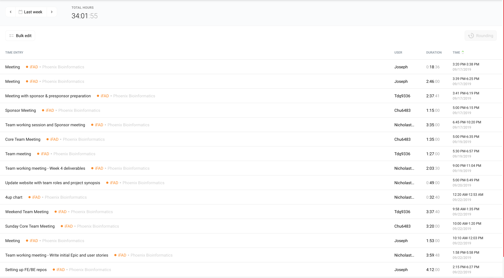
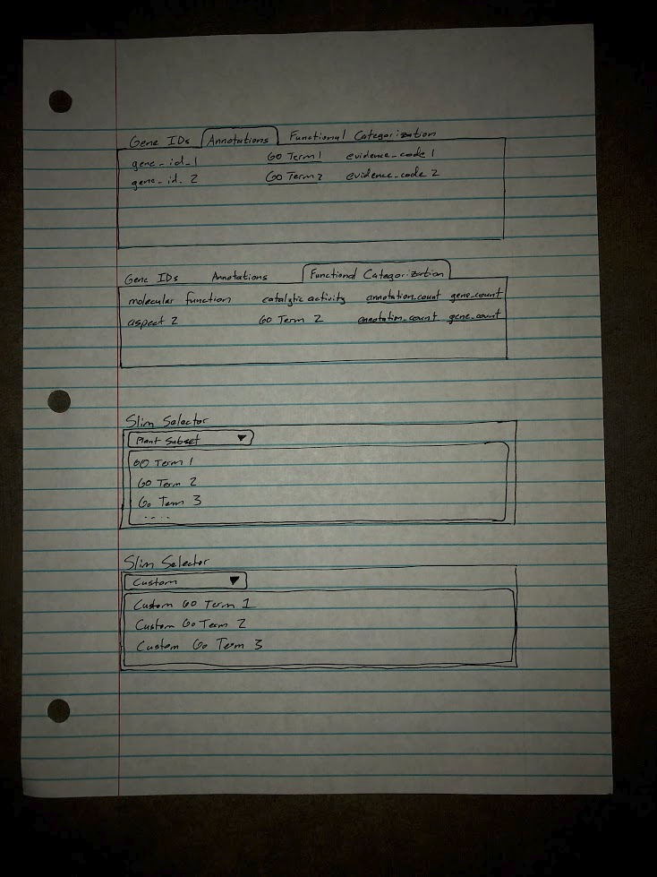
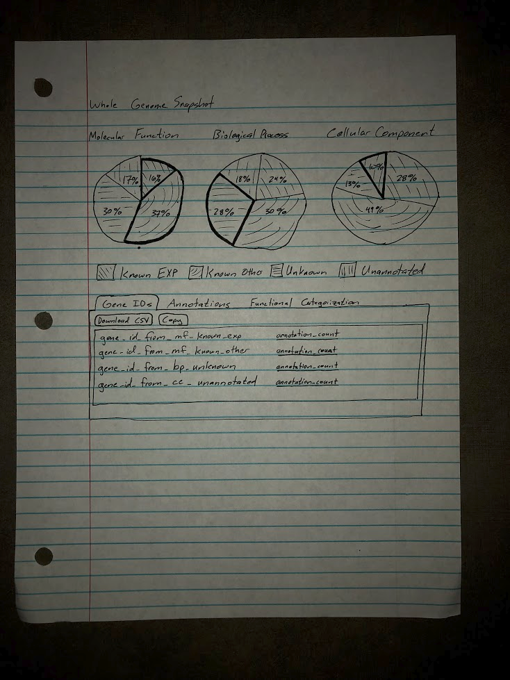
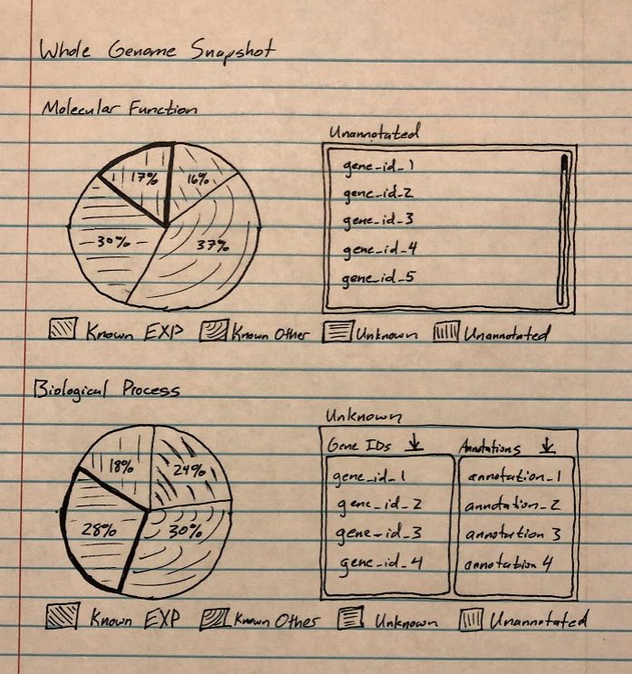
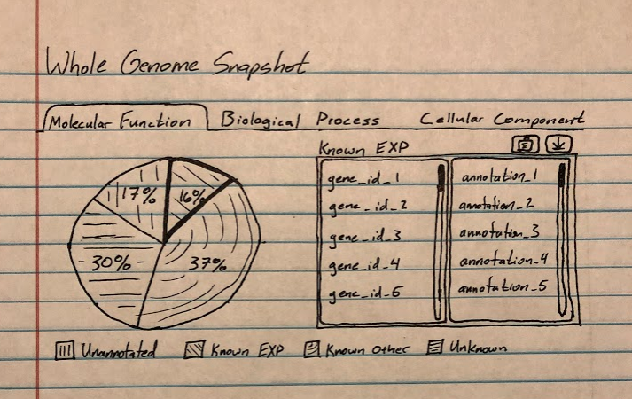

# Week 5 Project Report (2019-09-23)

## Four-Up Status

<table>
  <tr>
    <th>What's been done since the last update?</th>
    <th>What's currently in progress?</th>
  </tr>
  <tr>
    <td>
      <ul>
        <li>Wrote out initial Epics and user stories</li>
        <li>Got feedback about stories from the sponsor</li>
        <li>Received Github repos from sponsor</li>
      </ul>
    </td>
    <td>
      <ul>
        <li>Begin defining Functional Categorization Epic</li>
        <li>Begin prototyping UI/UX with sketches</li>
      </ul>
    </td>
  </tr>
  <tr>
    <th>What do we need to accomplish our goals?</th>
    <th>What are some risks we're facing?</th>
  </tr>
  <tr>
    <td>
      <ul>
        <li>Admin access to Github repos</li>
        <li>Feedback on the Functional Categorization Epic</li>
      </ul>
    </td>
    <td>
      <ul>
        <li>Have not started working on code</li>
      </ul>
    </td>
  </tr>
</table>

## Timesheet

## Wireframes

