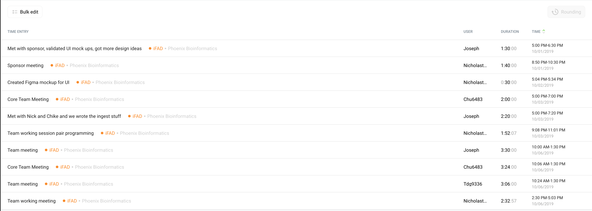

# Week 6 Project Report (2019-10-06)

## Four-Up Status

<table>
  <tr>
    <th>What's been done since the last update?</th>
    <th>What's currently in progress?</th>
  </tr>
  <tr>
    <td>
       Team Work:
      
      
      - Set up backend server.
      
      
      - Wrote GAF File ingester and parser.
      
      
      - Validated UI sketches with sponsor and got good feedback
      
      
      - Figma mockup   
   </td>
    <td>
      Team Work: 
  
  
      - Setting up Travis CI
      
      
      - Updating Project websites with four ups and status
      
      
      - Defining models in TypeScript
      
      
      - Building API routes 
         
   </td>
  </tr>
  <tr>
    <th>What do we need to accomplish our goals?</th>
    <th>What are some risks we're facing?</th>
  </tr>
  <tr>
    <td>
      List of specific evidence codes so as to hard-code our filtering process of Annotation status.
   </td>
    <td>
      We're having difficulty figuring out how to parse OBO files. There seems to be no known js parsers that would serve our needs.
    </td>
  </tr>
</table>

## Timesheet

