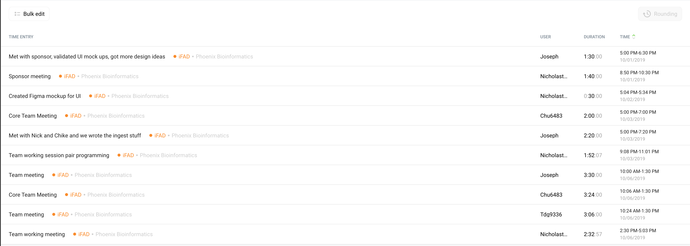

# Week 6 Project Report (2019-10-06)

## Four-Up Status

<table>
  <tr>
    <th>What's been done since the last update?</th>
    <th>What's currently in progress?</th>
  </tr>
  <tr>
    <td>
      <ul>
        <li>Set up backend server.</li>
        <li>Wrote GAF File ingester and parser.</li>
        <li>Validated UI sketches with sponsor and got good feedback</li>
        <li>Figma mockup</li>
      </ul>
   </td>
    <td>
      <ul>
        <li>Setting up Travis CI</li>
        <li>Updating Project websites with four ups and status</li>
        <li>Defining models in TypeScript</li>
        <li>Building API routes</li>
      </ul>
   </td>
  </tr>
  <tr>
    <th>What do we need to accomplish our goals?</th>
    <th>What are some risks we're facing?</th>
  </tr>
  <tr>
    <td>
      <ul>
        <li>List of specific evidence codes so as to hard-code our filtering process of Annotation status.<li>
      </ul>
   </td>
    <td>
      <ul>
        <li>We're having difficulty figuring out how to parse OBO files. There seems to be no known js parsers that would serve our needs.</li>
      </ul>
    </td>
  </tr>
</table>

## Timesheet

