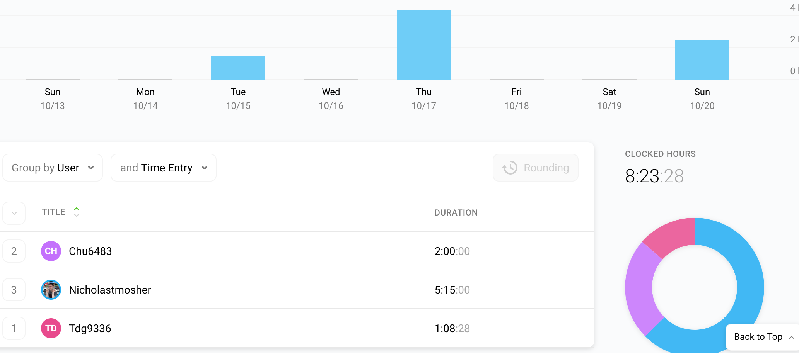

# Week 7 Project Report (2019-10-13)

## Four-Up Status

<table>
  <tr>
    <th>What's been done since the last update?</th>
    <th>What's currently in progress?</th>
  </tr>
  <tr>
    <td>
      <ul>
        <li>Built out Gene Snapshot API Routes</li>
        <li>Wrote GAF File ingester and parser</li>
        <li>Defined models in TypeScript</li>
        <li>Built out whole genome snapshot UI in front-end javascript </li>
      </ul>
   </td>
    <td>
      <ul>
        <li>Gene Snapshot integration API tests</li>
        <li>Validation for annotation status percentages</li>
        <li>Continuous Deployment brainstorming</li>
        <li>Tests for gene parsing</li>
      </ul>
   </td>
  </tr>
  <tr>
    <th>What do we need to accomplish our goals?</th>
    <th>What are some risks we're facing?</th>
  </tr>
  <tr>
    <td>
      <ul>
        <li>Access to AWS Console<li>
      </ul>
   </td>
    <td>
      <ul>
        <li>None of us have used ECS, may be tricky to get going</li>
        <li>Validating queries may take more effort than we thought</li>
      </ul>
    </td>
  </tr>
</table>

## Timesheet

