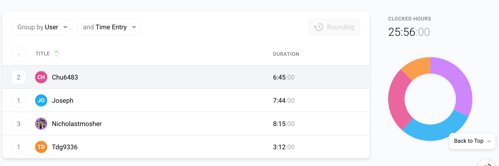

# Week 8 Project Report (2019-10-20)

## Four-Up Status

<table>
  <tr>
    <th>What's been done since the last update?</th>
    <th>What's currently in progress?</th>
  </tr>
  <tr>
    <td>
      <ul>
        <li>Set up AWS configs and access control for deployment</li>
        <li>Front-End development for gene list tabular view</li>
        <li>Showed UI progress and got feedback from sponsor</li>
      </ul>
   </td>
    <td>
      <ul>
        <li>More integration and unit tests for API functionality</li>
        <li>Validation for annotation status percentages -- Ongoing (Proving to be difficult)</li>
        <li>Continuous Deployment and docker preliminary setup</li>
      </ul>
   </td>
  </tr>
  <tr>
    <th>What do we need to accomplish our goals?</th>
    <th>What are some risks we're facing?</th>
  </tr>
  <tr>
    <td>
      <ul>
        <li>AWS Console access for ECS<li>
      </ul>
   </td>
    <td>
      <ul>
        <li>Validating the data returned by the endpoints is hard</li>
      </ul>
    </td>
  </tr>
</table>

## Timesheet

